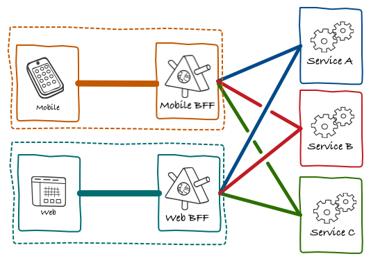
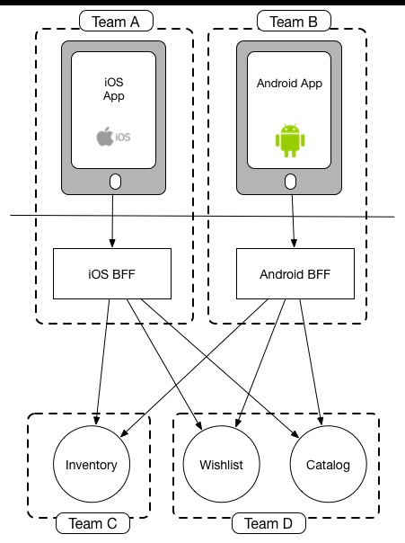
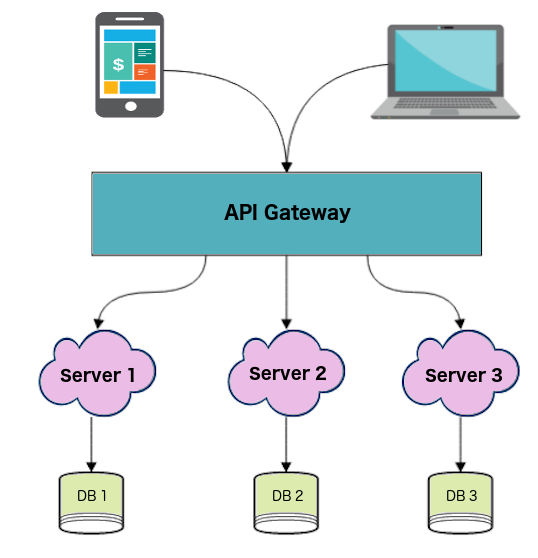
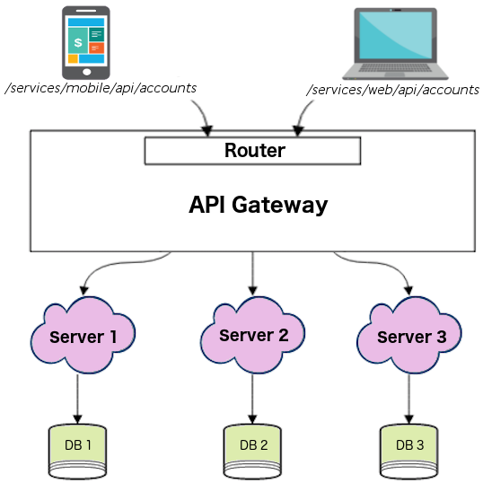

# Building a Microservice App

Building a cloud native app using a Microservice based architecture enables monolith applications to get split so that teams can independently develop the microservices so that they are scalable and can be deployed to production separately.

In a microservice architecture the frontend and backend separated.  The frontend application controls all of its own UI-level logic, while the business logic is accomplished through API calls to the relevant microservice. 

## Frontend Design

While many architects don't normally cover the frontend applications as part of the microservice architecture, in this example we will spend some time quickly discussing some of the options.  In the traditional frontend and backend design, the Mobile App or Website directly accesses the backend service, the backend microservices call each other, and then return the final result to the frontend client. For clients (especially mobile), too many HTTP requests are expensive.

In addition, the features of mobile devices are very different. Some have less screen real estate requiring to UI to display data differently. Others need to limit the number of requests to conservie battery life.

In order to minimize the number of requests, the frontend generally tends to obtain associated data through a single API. It means that sometimes the backend will do some UI-related logic processing to meet the needs of the client.

Using the BFF approach, each client will have a BFF service. With BFF, there are fewer mutual calls between microservices. This is because some UI logic is processed at the BFF level.




The BFF is tightly coupled to a specific user experience, and will typically be maintained by the same team as the user interface, thereby making it easier to define and adapt the API as the UI requires, while also simplifying process of lining up release of both the client and server components.


In addition, using the BFF’s approach the frontend (Mobile, Web) no longer directly accesses the backend microservices, but rather accesses it through the BFF layer. 

Further, while in some situations both iOS and Android can use the same BFF, its often better if each mobile type has a separate BFF.  Also, given the skills, experiences and varying technologies required, ios and android frontend applications are often maintained by different teams.

> Pete Hodgson made the observation that BFFs work best when aligned around team boundaries, so team 
> structure should drive how many BFFs you have. So that if you have a single mobile team, you > 
> should have one BFF, but if you had separate iOS and Android teams, you'd have separate BFFs. 

So you can see your organisation structure as being one of the main drivers to which model makes the most sense (Conway's Law wins again).

## Team Structure

F

https://samnewman.io/patterns/architectural/bff/




## API

In this context, the BFF acts as a middle-tier providing access between the frontend and backend. 

API ...

For example, lets consider a commom microservice, called "account". Many applications need an "account" microservice.

There are a couple ways to design the api to work with the microservice. 

Here are a cAPI Gateway does not distinguish between client types:
1. Single API for all clients
   ```
   /api/accounts
   ```



1. Separate APIs for each client and then processes them separately to return the resources required by different clients.
   ```
   /services/mobile/api/accounts
   /services/web/api/accounts.
   ```


1. Multiple API Gateways provide separate APIs for each client
BFF is actually considered like this implementation mode of API Gateway.


## REST API 

REST can be accessed through the following way:

Request:

```

GET http://127.0.0.1/api/accounts
```

Response:
```
[
  {
    "id": 88,
    "name": "Mena Meseha",
    "photo": "http://bucket.s3.amazonaws.com/photo.jpg"
  },
  ...
]
```

## References
1. [Frontend a Microservice Architecture](https://medium.com/@vivekmadurai/frontend-in-microservice-architecture-1e5bfa08e3e4)

1. [Backend-For-Frontend using GraphQL under Microservices](https://medium.com/tech-tajawal/backend-for-frontend-using-graphql-under-microservices-5b63bbfcd7d9)

1. [Pattern: Backends For Frontends](https://samnewman.io/patterns/architectural/bff/)

1. [Pattern: Backends For Frontends - Single-purpose Edge Services for UIs and external parties](https://samnewman.io/patterns/architectural/bff/)
