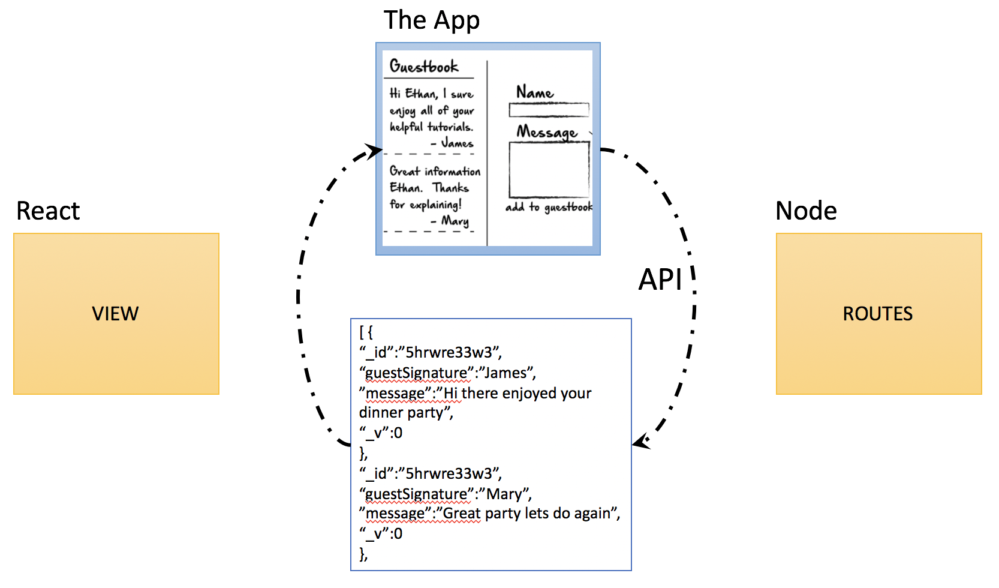

# Introduction


## References
1. [Frontend in Microservice Architecture](https://medium.com/@vivekmadurai/frontend-in-microservice-architecture-1e5bfa08e3e4)
2. [How to combine a nodejs back-end with a react front end](https://hackernoon.com/how-to-combine-a-nodejs-back-end-with-a-reactjs-front-end-app-ea9b24715032)
3. [Model View Controller(MVC)](https://en.wikipedia.org/wiki/Model%E2%80%93view%E2%80%93controller)
4. [How to setup MongoDB](https://docs.mongodb.com/manual/tutorial/install-mongodb-on-os-x/)
5. [Simplified MongoDB Architecture](https://www.mongodb.com/blog/post/the-modern-application-stack-part-5-using-reactjs-es6-and-jsx-to-build-a-ui-the-rise-of-mern)

## Best Practices
Building a Microservices based architecture make sense for many cloud based distributed applications. The Microservices approach allows a large project to split the development resources in to small independent teams. Using this approach helps improve scalability, complexity of the code, rolling out to production etc.

In a recent article[1], Vivek Madurai, identified several different approaches for frontend design
 - Monolith Frontend (also known as Model View Controller)
 - Modular/Component based Frontend
 - Micro Frontend

For simplity we will use the Model View Controller(MVC) architecture which allows us to split the development between multiple teams so that the frontend app can be maintained separately from that of microservice backend.


# Design Decisions

## React Overview
React is a JavaScript library for building UI components. Unlike more complete frameworks such as Angular or Vue, React deals only with the view layer. Hence, you’ll need additional libraries to handle things such as data flow, routing, authentication etc. In this guide, we’ll focus on what React can do.

Good tutorial:  https://www.sitepoint.com/getting-started-react-beginners-guide/

### Creating a React app
Developing a React App requires creating one or more React components that can interact with each other.
-	A React component is simply a JavaScript class that requires the render function to be declared.
-	The render function simply outputs HTML code, which is implemented using either JSX or JavaScript code.
-	A React component may also require additional functions for handling data, actions and lifecycle events.

React components can also be labeled as either stateful components (containers) or stateless components.
The purpose of the stateless component is to
1.	display data that it receives from its parent React component
2.	receive events and inputs, which it passes up to its parent to handle.

The purpose of the React container or stateful component is to
1.	render one or more child components
2.	fetch data from external sources and
3.	feeds it to its child components.

It also receives inputs and events from them in order to initiate actions. React uses a Virtual DOM to handle page rendering.

While solutions such as jQuery directly manipulate a web page via the HTML DOM, which can cause performance issues in some highly interactive cases, the Virtual DOM is much easier to manipulate, and is capable of handling numerous operations in milliseconds without affecting page performance.

```
my-app
├── README.md
├── node_modules
├── package.json
├── .gitignore
├── public
│   ├── favicon.ico
│   ├── index.html
│   └── manifest.json
└── src
    ├── App.css
    ├── App.js
    ├── App.test.js
    ├── index.css
    ├── index.js
    ├── logo.svg
    └── serviceWorker.js
```

=======

>>>>>>> dcac34fc5ea90d36a5142aa0d1fdf5b266ec909e


## Project Structure
```
project/
  controllers/
    users.js
  util/
    plugin.js
  middlewares/
    auth.js
  models/
    user.js
  routes/
    user.js
    router.js
  public/
    js/
    css/
    img/
  views/
    users/
      index.jade
  tests/
    users/
      create-user-test.js
      update-user-test.js
      get-user-test.js
  .gitignore
  app.js
  package.json
  ```


# MongoDB
## Architecture

## Install MongoDB Community Edition

```
$ brew tap mongodb/brew

$ brew install mongodb-community@4.0
```


In addition to the binaries, the install creates the:
- configuration file (/usr/local/etc/mongod.conf)
- log directory path (/usr/local/var/log/mongodb)
- data directory path (/usr/local/var/mongodb)
