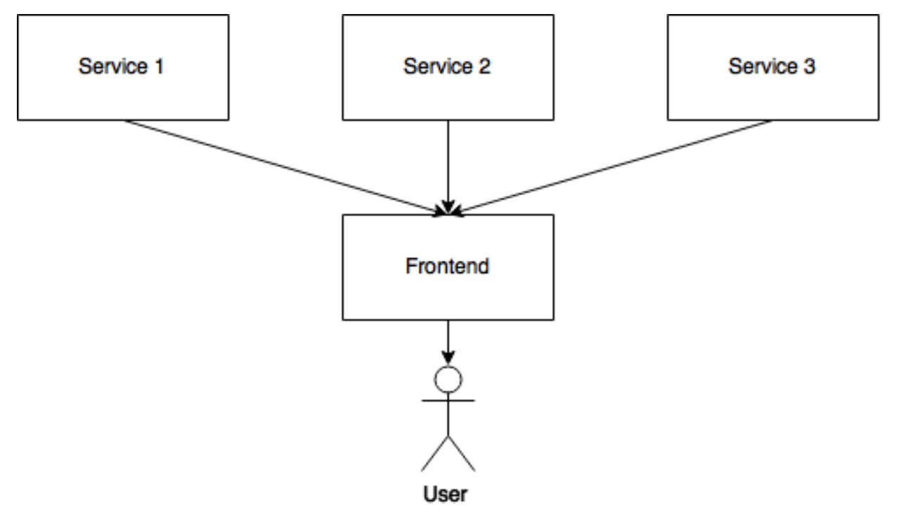

## References
1. [Frontend in Microservice Architecture](https://medium.com/@vivekmadurai/frontend-in-microservice-architecture-1e5bfa08e3e4)
2. [How to combine a nodejs back-end with a react front end](https://hackernoon.com/how-to-combine-a-nodejs-back-end-with-a-reactjs-front-end-app-ea9b24715032)
3. [Model View Controller(MVC)](https://en.wikipedia.org/wiki/Model%E2%80%93view%E2%80%93controller)
4. [How to setup MongoDB](https://docs.mongodb.com/manual/tutorial/install-mongodb-on-os-x/)
5. [Simplified MongoDB Architecture](https://www.mongodb.com/blog/post/the-modern-application-stack-part-5-using-reactjs-es6-and-jsx-to-build-a-ui-the-rise-of-mern)

## Best Practices
Building a Microservices based architecture make sense for many cloud based distributed applications. The Microservices approach allows a large project to split the development resources in to small independent teams. Using this approach helps improve scalability, complexity of the code, rolling out to production etc.

In a recent article[1], Vivek Madurai, identified several different approaches for frontend design
 - Monolith Frontend (also known as Model View Controller)
 - Modular/Component based Frontend
 - Micro Frontend

For simplity we will use the Model View Controller(MVC) architecture which allows us to split the development between multiple teams so that the frontend app can be maintained separately from that of microservice backend.



## Design Decisions


<<<<<<< HEAD
=======

>>>>>>> dcac34fc5ea90d36a5142aa0d1fdf5b266ec909e


## Project Structure
```
project/
  controllers/
    users.js
  util/
    plugin.js
  middlewares/
    auth.js
  models/
    user.js
  routes/
    user.js
    router.js
  public/
    js/
    css/
    img/
  views/
    users/
      index.jade
  tests/
    users/
      create-user-test.js
      update-user-test.js
      get-user-test.js
  .gitignore
  app.js
  package.json
  ```


# MongoDB
## Architecture

## Install MongoDB Community Edition

```
$ brew tap mongodb/brew

$ brew install mongodb-community@4.0
```


In addition to the binaries, the install creates the:
- configuration file (/usr/local/etc/mongod.conf)
- log directory path (/usr/local/var/log/mongodb)
- data directory path (/usr/local/var/mongodb)
