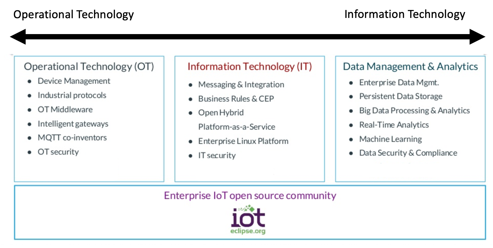

In this article we will explore some techniques for using containers to build iot application that can be used across different environments.  Using these techniques we will show you how you can use the same coding languages, frameworks, or tools for developing apps that will run in datacenters as well as on “edge” even if these apps must run on different CPU architectures.  In many cases, “Edge” computing nodes may run in remote datacenter or in multiple geo-distributed factories, ships, oil plants, and so on. 

In many cases, edge computing nodes may rely on custom hardware, however for this article we will use an x86_64 edge gateway as our target environment.
 
In our scenario, the IBM Garage has been asked to partner with a fictious, called “eHealth” to design, develop and deploy an edge solution using a combination of OpenShift and Red Hat Linux. 
 
To show how this can be done quickly, we will use an existing standalone IoT demo application, splitting it into different projects to create truly independent containers.

## Images

## References

1. IoT edge development and deployment with containers through OpenShift: Part 1
